# 🤖 A-AMM — Agentic Automated Market Maker

> **AI agents compete off-chain to fill your trades at the best price, powered by Uniswap v4 hooks, Yellow Network state channels, and ERC-8004 on-chain reputation.**

[](https://sepolia.etherscan.io)
[](https://docs.uniswap.org/contracts/v4/overview)
[](https://yellow.org)
[](https://eips.ethereum.org/EIPS/eip-8004)

---

## 🎯 The Problem

Traditional AMMs execute every swap through a fixed bonding curve. This means:

- **No price competition** — you get whatever the curve gives you, regardless of market conditions
- **MEV extraction** — bots sandwich your trades with zero accountability
- **No agent identity** — there's no way to track which market makers are trustworthy

## 💡 The Solution

A-AMM introduces an **intent-based swap layer** on top of Uniswap v4. Instead of executing immediately, swaps become **intents** that AI agents compete to fill — off-chain, gaslessly, in real-time.

The best quote wins. Agents build **on-chain reputation** via ERC-8004. And if no agent fills your trade? The standard Uniswap v4 AMM kicks in as a **trustless fallback**.

---

## 🔄 How It Works


---

## 🏗️ Architecture

```mermaid
graph TB
    subgraph Frontend["🌐 Frontend (React + TanStack Start)"]
        UI[Swap UI] --> Intents[Intent Feed]
        UI --> Board[Agent Leaderboard]
    end

    subgraph Contracts["⛓️ Smart Contracts (Foundry)"]
        Hook[A-AMM Hook] --> PM[Uniswap v4 PoolManager]
        Hook --> Pool[USDC/WETH Pool]
    end

    subgraph OffChain["☁️ Off-Chain Layer"]
        Agg[Aggregator] --> Yellow[Yellow ClearNode]
        Yellow --> S[🏃 Speedy Agent]
        Yellow --> C[🛡️ Cautious Agent]
        Yellow --> W[🐋 Whale Agent]
    end

    subgraph Reputation["🏆 ERC-8004 (Sepolia)"]
        ID[Identity Registry]
        Rep[Reputation Registry]
    end

    UI -->|swap intent| Hook
    Agg -->|detect intents| Hook
    S & C & W -->|fill()| Hook
    Agg -->|giveFeedback()| Rep
    Board -->|getSummary()| Rep
    Board -->|getMetadata()| ID
```

---

## 🧩 Key Components

| Component | Description | Tech |
|-----------|-------------|------|
| **A-AMM Hook** | Uniswap v4 hook that intercepts swaps as intents using the NoOp async pattern | Solidity, Foundry |
| **Aggregator** | Watches for intents, broadcasts RFQs, runs quote auctions, picks winners | TypeScript, viem |
| **AI Agents** | Compete to fill trades with different strategies (Speedy, Cautious, Whale) | TypeScript, viem |
| **Yellow Integration** | Gasless off-chain communication via state channels | @erc7824/nitrolite |
| **ERC-8004 Reputation** | On-chain agent identity + reputation scoring after each fill | Sepolia registries |
| **ENS Subnames** | Human-readable agent identities (speedy.aamm.eth) | Sepolia ENS |
| **Frontend** | Swap UI, real-time intent feed, agent leaderboard with reputation | React 19, wagmi, ConnectKit |

---

## 🤖 Demo Agents

| Agent | ENS | Strategy | Spread |
|-------|-----|----------|--------|
| 🏃 **Speedy** | `speedy.aamm.eth` | Always quotes fast, competitive pricing | 2% |
| 🛡️ **Cautious** | `cautious.aamm.eth` | Only quotes when spread is good, skips tight margins | 8% |
| 🐋 **Whale** | `whale.aamm.eth` | Handles large orders, slight premium | 3% |

Each agent is registered on **ERC-8004** with on-chain identity and builds reputation through successful fills. The leaderboard in the frontend queries the Reputation Registry to display scores.

---

## 📦 Project Structure

```
a-amm/
├── apps/
│   └── web/                  # 🌐 Frontend (Vite + React 19 + TanStack Start)
├── packages/
│   ├── contracts/            # ⛓️  Foundry — AammHook.sol, tests, deploy scripts
│   ├── aggregator/           # 📡 Quote auction coordinator (Yellow + ERC-8004)
│   ├── agents/               # 🤖 AI agents with strategies + ENS registration
│   ├── config/               # ⚙️  Shared TypeScript config
│   └── env/                  # 🔑 Environment variables (t3-env)
```

---

## 🚀 Quick Start

### Prerequisites

- [Bun](https://bun.sh) v1.3+
- [Foundry](https://book.getfoundry.sh/getting-started/installation) (for contracts)

### Install & Run

```bash
# Install dependencies
bun install

# Run the frontend (connects to Sepolia)
bun run dev:web

# Open http://localhost:3001
```

### Run the Full Stack (Agents + Aggregator)

```bash
# Terminal 1: Start the aggregator
cd packages/aggregator
bun run src/run.ts

# Terminal 2-4: Start each agent
cd packages/agents
APP_SESSION_ID=0x... AGENT_STRATEGY=speedy   AGENT_PRIVATE_KEY=0x... bun run src/run.ts
APP_SESSION_ID=0x... AGENT_STRATEGY=cautious AGENT_PRIVATE_KEY=0x... bun run src/run.ts
APP_SESSION_ID=0x... AGENT_STRATEGY=whale    AGENT_PRIVATE_KEY=0x... bun run src/run.ts
```

### Run Contract Tests

```bash
cd packages/contracts
forge test -vvv
```

---

## 🌐 Deployed Contracts (Sepolia)

| Contract | Address |
|----------|---------|
| **A-AMM Hook** | [`0x964453F9c597e30EB5C2f331b389FD0eA8d6c0c8`](https://sepolia.etherscan.io/address/0x964453F9c597e30EB5C2f331b389FD0eA8d6c0c8) |
| **Pool** | Circle USDC / WETH (fee=3000, tickSpacing=60) |
| **ERC-8004 Identity** | [`0x8004A818BFB912233c491871b3d84c89A494BD9e`](https://sepolia.etherscan.io/address/0x8004A818BFB912233c491871b3d84c89A494BD9e) |
| **ERC-8004 Reputation** | [`0x8004B663056A597Dffe9eCcC1965A193B7388713`](https://sepolia.etherscan.io/address/0x8004B663056A597Dffe9eCcC1965A193B7388713) |

### ENS Subnames (Sepolia)

| Name | Resolves To |
|------|-------------|
| `speedy.aamm.eth` | `0xd94C17B860C4B0Ca8f76586803DdD07B976cA6A2` |
| `cautious.aamm.eth` | `0x4210d287a6A28F96967c2424f162a0BCDd101694` |
| `whale.aamm.eth` | `0x98cA02732d4646000b729292d36de6A853FF00cA` |

---

## 🛡️ The Trustless Fallback

A-AMM is designed so **users never get stuck**. If no agent fills your trade before the deadline (30 blocks), anyone can call `fallbackToAMM()` to execute the swap through the standard Uniswap v4 concentrated liquidity pool. Your trade always goes through.

```mermaid
flowchart LR
    A[User submits swap] --> B{Agent fills<br/>before deadline?}
    B -->|Yes ✅| C[Better price from agent]
    B -->|No ⏰| D[fallbackToAMM executes<br/>standard v4 swap]
    C --> E[User gets tokens]
    D --> E
```



---

## 🔧 Tech Stack

| Layer | Technology |
|-------|-----------|
| **Smart Contracts** | Solidity, Foundry, Uniswap v4 (v4-core) |
| **Off-Chain Messaging** | Yellow Network (@erc7824/nitrolite), WebSocket |
| **Agent Reputation** | ERC-8004 (Identity + Reputation Registries) |
| **Agent Identity** | ENS subnames on Sepolia |
| **Frontend** | React 19, Vite 7, TanStack Start, wagmi, ConnectKit |
| **Styling** | Tailwind CSS 4, shadcn/ui, terminal aesthetic |
| **Monorepo** | Turborepo, Bun |

